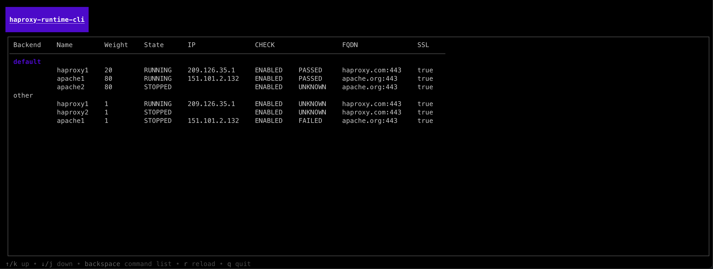
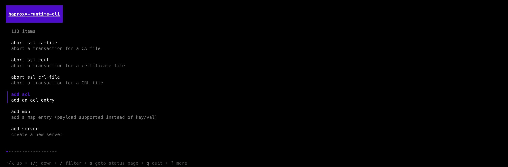
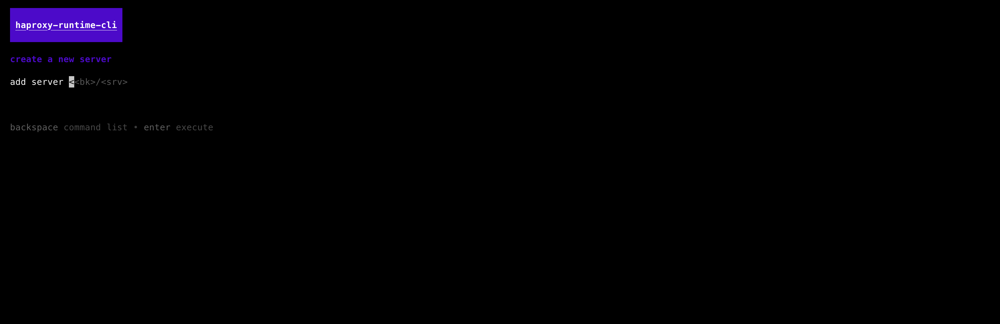

# Haproxy Runtime CLI

> connect to a HaProxy Socket and issue commands interactivly

build with the awesome universe of [charm](https://charm.sh/).
All of their tools are high class ❤️ but i especially like the
[ELM Architecture](https://guide.elm-lang.org/architecture/), once
you get used to it, you'll love the simplicity.

What is the Runtime-API? Read [here](https://www.haproxy.com/documentation/haproxy-runtime-api/)





## Usage

Download your binary from [here](https://github.com/digitalkaoz/haproxy-runtime-cli/releases)


```shell
$ haproxy-runtime-cli /path/to/haproxy.sock

```
## Development

```shell
$ go get
$ go run .
```

To build the binary locally:

```shell
$ goreleaser build --snapshot --clean
$ cp ./dist/haproxy-runtime-cli_xxx/haproxy-runtime-cli /usr/local/bin/haproxy-runtime-cli
$ chmod a+x /usr/local/bin/haproxy-runtime-cli
```

## TODO

- [ ] improve execute ui?
